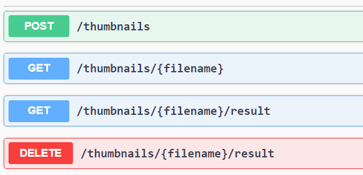

# thumbnail-service
A basic web service to compute jpg thumbnails.     

## Testing
    
The project is based on maven thus to run tests form the root directory run 

    mvn clean test

## Creating the docker image
The docker image can be generated with the already present maven configuration with the following command

    mvnw spring-boot:build-image -Dspring-boot.build-image.imageName=luigidb/thumbnail-service -DskipTests

The local docker image can be uploaded to docker hub with

    docker login –u luigidb
    docker push luigidb/thumbnail-service:latest

## Run the service
With maven run 

    mvn spring-boot:run

With the "official" docker image   

    docker run –p 8080:8080 –t luigidb/thumbnail-service:latest

## Update Docker image  

Just for reference the local docker image can be uploaded to docker hub with  
    
    docker login –u luigidb
    docker push luigidb/thumbnail-service:latest

## API endpoints



### /thumbnails
This one is the main entry point and is used to load images to the service.
Support only POST method and answers with 202 (ACCEPTED) 

Usage:

    curl --location --request POST 'localhost:8080/thumbnails' --form 'file=@"/E:/orange.jpg"'

The response contains also useful links to the subsequent necessary api to download the thumbnail and to monitor 
the status of the operation.

Example reply from the provided usage:
```
{
    "_links": {
        "thumbnail": {
            "href": "http://localhost:8080/thumbnails/thumbnail_orange.jpg/result"
        },
        "status": {
            "href": "http://localhost:8080/thumbnails/orange.jpg"
        }
    }
}
```
### /thumbnails/{filename}
This endpoint monitor the processing of the thumbnails. 
Support only the GET method and can answer with 
* 303 (REDIRECT) If the thumbnail has already been created 
* 404 (NOT FOUND) If the thumbnail is still in the processing

Usage:

    curl --location --request GET 'localhost:8080/thumbnails/orange.jpg'

In case of 303 reply embedded in the response there is a link to the api needed to download the thumbnail.
```
{
    "_links": {
        "thumbnail": {
            "href": "http://localhost:8080/thumbnails/thumbnail_orange.jpg/result"
        }
    }
}
```

### /thumbnails/{filename}/result
This endpoint is the one needed to retrieve and delete the thumbnails.
Support GET and DELETE methods and can answer with
* GET 
  * 200 (OK) with the thumbnail in the body 
  * 404 (NOT FOUND) If the thumbnail cannot be found
* DELETE 
  * 202 (ACCEPTED)

Usage:

    curl --location --request GET 'localhost:8080/thumbnails/thumbnail_orange.jpg/result'

    curl --location --request DELETE 'localhost:8080/thumbnails/thumbnail_orange.jpg/result'

## Architecture
The provided implementation is really simple, and  we can found 4 main components:
* The REST controller
  
  Responsible for the API handling.
* The asynchronous service to produce the thumbnails
  
  Responsible for the deferred calculation of the thumbnails. 
* An ephemeral storage 
  
  Used to store the original images. 
* A persistent storage 

  used to store the thumbnails until an user decide to delete them.

The provided implementations are very simple, but they show a valid proof of concept of how a real architecture should work. 

The asynchronous handling of the thumbnail is now done with a simple java Executor; this work for very low workload but 
with a high workload can be easily swapped for a more robust alternative. The best option is to separate the service as 
stand-alone since the processing is totally stateless.  

Regarding the storage I choose to keep two separated entities because user provided images and thumbnails they have 
different lives. The user provided images are short-lived since we only need to store them for the time necessary to 
generate the thumbnail. The thumbnails instead need to be stored until the user decide to explicitly delete them; this 
means that we need a long-running database with availability guarantees.  

In the provided service the storage is implemented on top of the filesystem just as an initial development. In a real 
scenario as the load increases a proper databases need to be used for storing the thumbnails. For the user images 
is probably better to store them in a persistent queue shared with the thumbnail creator service rather than a database. 
We only need them for the thumbnail service until the processing is complete thus having them stored in a DB can be more 
cumbersome than useful since the database is intrinsically slower at scale when multiple replicas need to be 
maintained. 

Moreover, the queue approach present additional benefits: in when for scaling purposes the 4 components are split in
different microservices. In that case it's possible to instantiate multiple running instances of the thumbnail creator 
service where each one independently   


## Functional enhancements
[ ] Generate an Id for each image and use it in the api rather than the filenames; It's easier to maintain and simplifies 
the API and more importantly permit to have more thumbnails with the same name.

[ ] In the current architecture server errors are exposed to the user in a more robust environment errors need to be handled

[ ] Add input sanity checks; file format, headers, max file size, ...